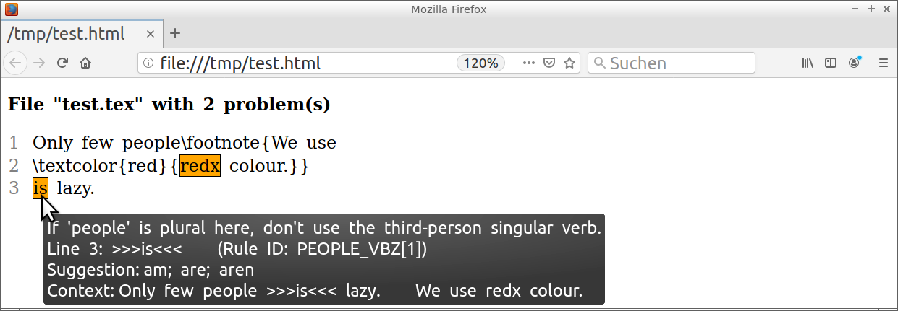
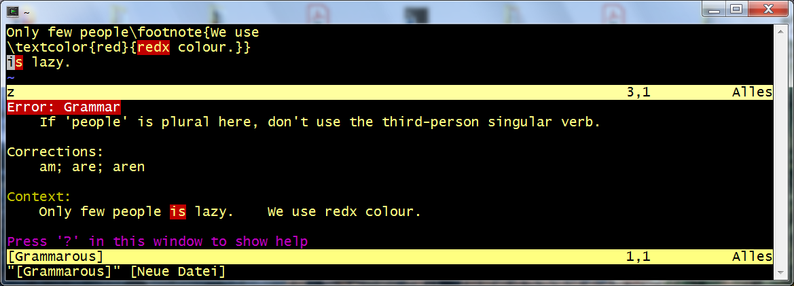
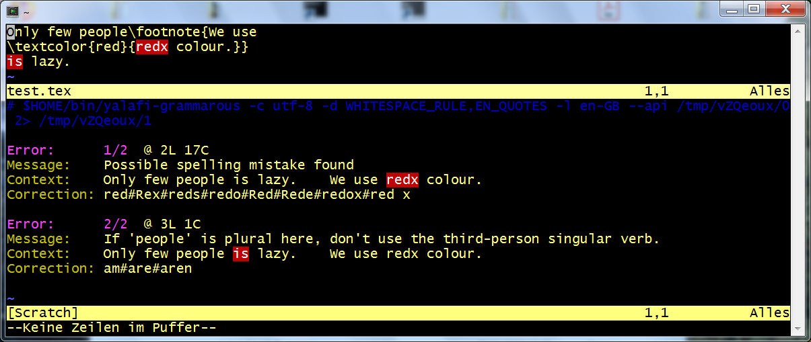
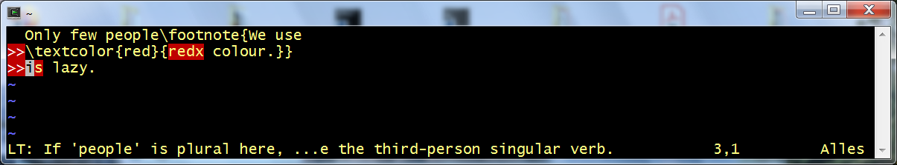
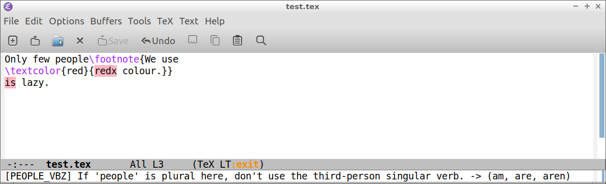
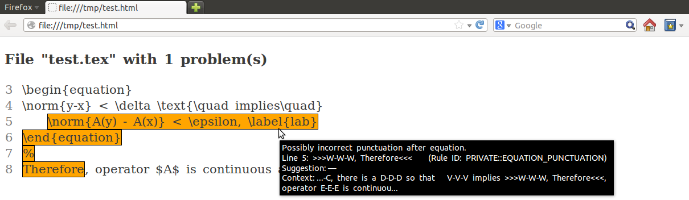

# YaLafi: Yet another LaTeX filter

[Related projects](#related-projects)&nbsp;\|
[Installation](#installation)&nbsp;\|
[Example application](#example-application)&nbsp;\|
[Interface to Vim](#interface-to-vim)&nbsp;\|
[Interface to Emacs](#interface-to-emacs)&nbsp;\|
[Filter actions](#filter-actions)&nbsp;\|
[Principal limitations](#principal-limitations)&nbsp;\|
[Usage under Windows](#usage-under-windows)&nbsp;\|
[Extension modules for LaTeX packages](#extension-modules-for-latex-packages)&nbsp;\|
[Inclusion of own macros](#inclusion-of-own-macros)&nbsp;\|
[Python package interface](#python-package-interface)&nbsp;\|
[Handling of displayed equations](#handling-of-displayed-equations)&nbsp;\|
[Command-line of pure filter](#command-line-of-pure-filter)&nbsp;\|
[Differences to Tex2txt](#differences-to-tex2txt)&nbsp;\|
[Remarks on implementation](#remarks-on-implementation)

**Notice.**
The library of LaTeX macros, environments, document classes, and packages is
still rather restricted, compare the [list of macros](list-of-macros.md).
Please don't hesitate to
[raise an Issue](https://github.com/matze-dd/YaLafi/issues),
if you would like to see something added.

This Python (version 3.x) package extracts plain text from LaTeX documents.
The software may be integrated with a proofreading tool and an editor.
It provides
- mapping of character positions between LaTeX and plain text,
- simple inclusion of own LaTeX macros and environments with tailored
  treatment,
- careful conservation of text flows,
- some parsing of displayed equations for detection of interpunction problems.

The sample Python application script
[yalafi/shell/shell.py](yalafi/shell/shell.py) from section
[Example application](#example-application) integrates the LaTeX filter
with the proofreading software [LanguageTool](https://www.languagetool.org).
It sends the extracted plain text to the proofreader,
maps position information in returned messages back to the LaTeX text,
and generates results in different formats.
You may easily
- create a proofreading report in text or HTML format for a complete
  document tree,
- check LaTeX texts in the editors Emacs and Vim via several plugins,
- run the script as emulation of a LanguageTool server with integrated
  LaTeX filtering.

For instance, the LaTeX input
```
Only few people\footnote{We use
\textcolor{red}{redx colour.}}
is lazy.
```
will lead to the text report
```
1.) Line 2, column 17, Rule ID: MORFOLOGIK_RULE_EN_GB
Message: Possible spelling mistake found
Suggestion: red; Rex; reds; redo; Red; Rede; redox; red x
Only few people is lazy.    We use redx colour. 
                                   ^^^^
2.) Line 3, column 1, Rule ID: PEOPLE_VBZ[1]
Message: If 'people' is plural here, don't use the third-person singular verb.
Suggestion: am; are; aren
Only few people is lazy.    We use redx colour. 
                ^^
```
<a name="example-html-report"></a>
This is the corresponding HTML report
(for another example, [see here](#equation-html-report)):



The tool builds on results from project
[Tex2txt](https://github.com/matze-dd/Tex2txt),
but differs in the internal processing method.
Instead of using recursive regular expressions, a simple tokeniser
and a small machinery for macro expansion are implemented; see sections
[Differences to Tex2txt](#differences-to-tex2txt) and
[Remarks on implementation](#remarks-on-implementation).

Beside the interface from section
[Python package interface](#python-package-interface),
application Python scripts like [yalafi/shell/shell.py](yalafi/shell/shell.py)
from section [Example application](#example-application)
can access an interface emulating tex2txt.py from repository Tex2txt by
'from yalafi import tex2txt'.

The pure LaTeX filter can be directly used in scripts via a command-line
interface, it is described in section
[Command-line of pure filter](#command-line-of-pure-filter).

If you use this software and encounter a bug or have other suggestions
for improvement, please leave a note under category [Issues](../../issues),
or initiate a pull request.
Many thanks in advance.

Happy TeXing!

[Back to top](#yalafi-yet-another-latex-filter)


## Related projects

This project relates to software like
- [OpenDetex](https://github.com/pkubowicz/opendetex),
- [pandoc](https://github.com/jgm/pandoc),
- [plasTeX](https://github.com/tiarno/plastex),
- [pylatexenc](https://github.com/phfaist/pylatexenc),
- [TeXtidote](https://github.com/sylvainhalle/textidote),
- [tex2txt](http://hackage.haskell.org/package/tex2txt), and
- [vscode-ltex](https://github.com/valentjn/vscode-ltex).

From these examples, currently (March 2020) only TeXtidote and vscode-ltex
provide position mapping between the LaTeX input text and the plain text
that is sent to the proofreading software.
Both use (simple) regular expressions for plain-text extraction and are
easy to install.
YaLafi, on the other hand, aims to achieve high flexibility and a
good filtering quality with minimal number of false positives from the
proofreading software.

[Back to top](#yalafi-yet-another-latex-filter)


## Installation

Choose one of the following possibilities.

- Use `python -m pip install [--user] yalafi`.
  This installs the last version uploaded to [PyPI](https://www.pypi.org).
  Module pip itself can be installed with `python -m ensurepip`.
- Say `python -m pip install [--user] git+https://github.com/matze-dd/YaLafi.git@master`.
  This installs the current snapshot from here.
- Download the archive from here and unpack it.
  Place yalafi/ in the working directory, or in a standard directory like
  `/usr/lib/python3.x/` or `~/.local/lib/python3.x/site-packages/`.
  You can also locate it somewhere else and set environment variable
  PYTHONPATH accordingly.

[Back to top](#yalafi-yet-another-latex-filter)


## Example application

**Remark.**
You can find examples for tool integration with Bash scripts in
[Tex2txt/README.md](https://github.com/matze-dd/Tex2txt#tool-integration).

Example Python script [yalafi/shell/shell.py](yalafi/shell/shell.py)
has been copied with minor changes from repository
[Tex2txt](https://github.com/matze-dd/Tex2txt)
and subdivided into several files.
It will generate a proofreading report in text or HTML format from filtering
the LaTeX input and application of
[LanguageTool](https://www.languagetool.org) (LT).
It is best called as module as shown below, but can also be placed elsewhere
and invoked as script.
On option '--server lt', LT's Web server is contacted.
Otherwise, [Java](https://java.com) has to be present, and
the path to LT has to be specified with --lt-directory.
Note that from version 4.8, LT does not fully support 32-bit systems any more.
Both LT and the script will print some progress messages to stderr.
They can be suppressed with `python ... 2>/dev/null`.
```
python -m yalafi.shell [OPTIONS]
                latex_file [latex_file ...] [> text_or_html_file]
```
Option names may be abbreviated.
If present, options are also read from a configuration file designated by
script variable 'config\_file' (one option per line, possibly with argument),
unless --no-config is given.
Default option values are set at the Python script beginning.

- `--lt-directory dir`<br>
  Directory of the local LT installation.
  May be omitted on options '--server lt' and '--textgears apikey',
  or if script variable 'ltdirectory' has been set appropriately.
  For instance, the directory has to contain file 'languagetool-server.jar'.
  The LT zip archive, for example LanguageTool-4.9.zip, can be obtained
  from the [LT download page](https://www.languagetool.org/download).
  See also the script comment at variable 'ltdirectory' (default value).
- `--lt-command cmd`<br>
  Set base command to call LT (default value in script variable 'ltcommand').
- `--as-server port`<br>
  Emulate an LT server listening on the given port, for an example
  see section [Interface to Emacs](#interface-to-emacs).
  The fields of received HTML requests (settings for language, rules,
  categories) overwrite option values given in the command line.
  The internally used proofreader is influenced by options like --server.
  Other options like --single-letters remain effective.
- `--output mode`<br>
  Mode is one of 'plain', 'html', 'xml', 'xml-b', 'json'
  (default: 'plain' for text report).
  Variant 'html' generates an HTML report, see below for further details.
  Modes 'xml' and 'xml-b' are intended for Vim plugins, compare section
  [Interface to Vim](#interface-to-vim).
- `--link`<br>
  In an HTML report, left-click on a highlighted text part opens a
  Web link related to the problem, if provided by LT.
- `--context number`<br>
  Number of context lines displayed around each marked text region
  in HTML report (default: 2).
  A negative number shows the whole text.
- `--include`<br>
  Track file inclusions like \\input{...}.
  Script variable 'inclusion\_macros' contains a list of the corresponding
  LaTeX macro names.
- `--skip regex`<br>
  Skip files matching the given regular expression.
  This is useful, e.g., for the exclusion of figures on option --include.
- `--plain-input`<br>
  Assume plain-text input, do not evaluate LaTeX syntax.
  This cannot be used together with options --include or --replace.
- `--list-unknown`<br>
  Only print list of unknown macros and environments seen outside of
  maths parts.
- `--language lang`<br>
  Language code as expected by LT (default: 'en-GB').
  The first two letters are passed to function 'tex2txt()' from module
  yalafi.tex2txt that uses 'en' in case of an unknown language.
- `--encoding ienc`<br>
  Encoding for LaTeX input and files from options --define and --replace
  (default: UTF-8).
- `--replace file`<br>
  File with phrase replacements to be performed after the conversion to
  plain text.
  Per line, a '\&' sign separated by space splits two parts: the first part
  is replaced by the second part.
  Space in the first part is interpreted as arbitrary space not breaking
  the paragraph.
  A '\#' sign marks the rest of line as comment.
- `--define file`<br>
  Read macro definitions as LaTeX code (using \\newcommand).
  If the code invokes \\documentclass or \\usepackage, then the corresponding
  modules are loaded.
- `--documentclass  class`<br>
  Load extension module for this class.
  See section
  [Extension modules for LaTeX packages](#extension-modules-for-latex-packages).
- `--packages modules`<br>
  Load these extension modules for LaTeX packages (default: '\*').
  See section
  [Extension modules for LaTeX packages](#extension-modules-for-latex-packages).
- `--add-modules file`<br>
  Parse the given LaTeX file and prepend all modules included by macro
  \\usepackage to the list provided in option --packages.
  Value of option --documentclass is overridden by macro \\documentclass.
- `--extract macros`<br>
  Only check arguments of the LaTeX macros whose names are given as
  comma-separated list.
  This is useful for check of foreign-language text, if marked accordingly.
  Internally used for detection of file inclusions on --include.
- `--disable rules`<br>
  Comma-separated list of ignored LT rules, is passed as --disable to LT
  (default: 'WHITESPACE\_RULE').
- `--enable rules`<br>
  Comma-separated list of added LT rules, is passed as --enable to LT
  (default: '').
- `--disablecategories cats`<br>
  `--enablecategories cats`<br>
  Disable / enable LT rule categories, directly passed to LT
  (default for both: '').
- `--lt-options opts`<br>
  Pass additional options to LT, given as single string in argument 'opts'.
  The first character of 'opts' will be skipped and must not be '-'.
  Example:
  `--lt-options '~--languagemodel ../Ngrams --disablecategories PUNCTUATION'`.
  Some options are included into HTML requests to an LT server, see script
  variable 'lt\_option\_map'.
- `--single-letters accept`<br>
  Check for single letters, accepting those in the patterns given as list
  separated by '\|'.
  Example: `--single-letters 'A|a|I|e.g.|i.e.||'` for an English text,
  where the trailing '\|\|' causes the addition of equation replacements
  from script variable 'equation\_replacements'.
  All characters except '\|' are taken verbatim, but '~' and '\\,' are
  interpreted as UTF-8 non-breaking space and narrow non-breaking space.
- `--equation-punctuation mode`<br>
  This is an experimental hack for the check of punctuation after equations
  in English texts, compare section
  [Equation replacements in English documents](#equation-replacements-in-english-documents).
  An example is given in section
  [Differences to Tex2txt](#differences-to-tex2txt).
  The abbreviatable mode values indicate the checked equation type:
  'displayed', 'inline', 'all'.<br>
  The check generates a message, if an element of an equation is not
  terminated by a dot '.', and at the same time is not followed by a
  lower-case word or another equation element, both possibly separated by
  a punctuation mark from ',;:'.
  Patterns for equation elements are given by script variables
  'equation\_replacements\_display' and 'equation\_replacements\_inline',
  corresponding to member variables 'Parameters.math\_repl\_display' and
  'Parameters.math\_repl\_inline' in file yalafi/parameters.py.
- `--server mode`<br>
  Use LT's Web server (mode is 'lt') or a local LT server (mode is 'my')
  instead of LT's command-line tool.
  Stop the local server (mode is 'stop', currently only works under Linux
  and Cygwin).
  - LT's server: Server address is set in script variable 'ltserver'.
    For conditions and restrictions, please refer to
    [http://wiki.languagetool.org/public-http-api](http://wiki.languagetool.org/public-http-api).
  - Local server: If not yet running, then start it according to script
    variable 'ltserver\_local\_cmd'.
    Additional server options can be passed with --lt-server-options.
    See also
    [http://wiki.languagetool.org/http-server](http://wiki.languagetool.org/http-server).
    This may be faster than the command-line tool used otherwise, especially
    for a large number of LaTeX files or together with an editor plugin.
    The server will not be stopped at the end (use '--server stop').
- `--lt-server-options opts`<br>
  Pass additional options when starting a local LT server.
  Syntax is as for --lt-options.
- `--textgears apikey`<br>
  Use the TextGears server, see [https://textgears.com](https://textgears.com).
  Language is fixed to American English.
  The access key 'apikey' can be obtained on page
  [https://textgears.com/signup.php?givemethatgoddamnkey=please](https://textgears.com/signup.php?givemethatgoddamnkey=please),
  but the key 'DEMO\_KEY' seems to work for short input.
  The server address is given by script variable 'textgears\_server'.
- `--no-config`<br>
  Do not read config file, whose name is set in script variable 'config\_file'.

**Dictionary adaptation.**
LT evaluates the two files 'spelling.txt' and 'prohibit.txt' in directory
```
.../LanguageTool-?.?/org/languagetool/resource/<lang-code>/hunspell/
```
Additional words and words that shall raise an error can be appended here.
LT version 4.8 introduced additional files 'spelling\_custom.txt' and
'prohibit\_custom.txt'.

**HTML report.**
The idea of an HTML report goes back to Sylvain Hallé, who developed
[TeXtidote](https://github.com/sylvainhalle/textidote).
Opened in a Web browser, the report displays excerpts from the original 
LaTeX text, highlighting the problems indicated by LT.
The corresponding LT messages can be viewed when hovering the mouse
over these marked places, see the
[introductory example](#example-html-report) above.
With option --link, Web links provided by LT can be directly opened with
left-click.
Script option --context controls the number of lines displayed
around each tagged region;
a negative option value will show the complete LaTeX input text.
If the localisation of a problem is unsure, highlighting will use yellow
instead of orange colour.
For simplicity, marked text regions that intertwine with other ones
are separately repeated at the end.
In case of multiple input files, the HTML report starts with an index.

[Back to top](#yalafi-yet-another-latex-filter)


## Interface to Vim

As [\[Vim\]](https://www.vim.org)
is a great editor, there are several possibilities that build
on existing Vim plugins or use Vim's compiler interface.

- [Application of plugin vimtex](#application-of-plugin-vimtex)
- [Application of plugin vim-grammarous](#application-of-plugin-vim-grammarous)
- [Application of plugin vim-LanguageTool](#application-of-plugin-vim-languageTool)
- [Application of plugin ALE](#application-of-plugin-ale)
- [Application via compiler interface](#application-via-compiler-interface)

### Application of plugin vimtex

The Vim plugin [\[vimtex\]](https://github.com/lervag/vimtex)
provides comprehensive support for writing LaTeX documents.
It includes an interface to YaLafi, documentation is available with
`:help vimtex-grammar-vlty`.
A copy of the corresponding Vim compiler script is [vlty.vim](vlty.vim).

The following vimrc snippet demonstrates some useful settings for vlty
option field 'shell\_options'.
```
let g:vimtex_grammar_vlty.shell_options =
    \   ' --packages "*"'
    \ . ' --define ~/vlty/defs.tex'
    \ . ' --replace ~/vlty/repls.txt'
```
- By default, the vlty compiler passes names of all necessary LaTeX packages
  to YaLafi, which may result in annoying warnings.
  These my by avoided by `--packages "*"` that simply loads all packages
  known to the filter.
- YaLafi's expansion of project-specific macros can be controlled via
  option `--define ...`.
  Example for defs.tex:
```
\newcommand{\zB}{z.\,B. }   % LanguageTool correctly insists on
                            % narrow space in this German abbreviation
\newtheorem{Satz}{Satz}     % correctly expand \begin{Satz}[siehe ...]
\LTinput{main.glsdefs}      % read database of glossaries package
```
- Replacement of phrases may be performed via `--replace ...`, compare
  section [Example application](#example-application).

### Application of plugin vim-grammarous

For the Vim plugin
[\[vim-grammarous\]](https://github.com/rhysd/vim-grammarous),
it is possible to provide an interface for checking LaTeX texts.
With an entry in \~/.vimrc, one may simply replace the command that
invokes LanguageTool.
For instance, you can add to \~/.vimrc
```
let g:grammarous#languagetool_cmd = '/home/foo/bin/yalafi-grammarous'
map <F9> :GrammarousCheck --lang=en-GB<CR>
```
A proposal for Bash script /home/foo/bin/yalafi-grammarous (replace foo
with user name ;-) is given in [yalafi-grammarous](yalafi-grammarous).
It has to be made executable with `chmod +x ...`.
Please adapt script variable `ltdir`, compare option --lt-directory
in section [Example application](#example-application).
If you do not want to have started a local LT server, comment out the line
defining script variable `use_server`.

In order to avoid the problem described in
[Issue \#89\@vim-grammarous](https://github.com/rhysd/vim-grammarous/issues/89)
(shifted error highlighting, if after non-ASCII character on same line),
you can set `output=xml-b` in yalafi-grammarous.

<a name="troubleshooting-for-vim-interface"></a>
**Troubleshooting for Vim interface.**
If Vim reports a problem with running LT, you can do the following.
In `~/bin/yalafi-grammarous`, comment out the final `... 2>/dev/null`.
For instance, you can just place a '\#' in front: `... # 2>/dev/null`.
Then start, with a test file t.tex,
```
$ ~/bin/yalafi-grammarous t.tex
```
This should display some error message, if the problem goes back to
running the script, Python, yalafi.shell or LanguageTool.

**Installation of vim-grammarous.**
Download and unzip vim-grammarous.
Create a directory \~/.vim/pack/bundle/start/.
Place vim-grammarous/ under this directory.

Here is the [introductory example](#example-html-report) from above:



### Application of plugin vim-LanguageTool

The Vim plugin
[\[vim-LanguageTool\]](https://github.com/dpelle/vim-LanguageTool)
relies on the same XML interface to LanguageTool as the previous variant.
Therefore, one can reuse the Bash script
[yalafi-grammarous](yalafi-grammarous).
You can add to \~/.vimrc
```
let g:languagetool_cmd = '$HOME/bin/yalafi-grammarous'
let g:languagetool_lang = 'en-GB'
let g:languagetool_disable_rules = 'WHITESPACE_RULE'
map <F9> :LanguageToolCheck<CR>
```
Please note the general problem indicated in
[Issue #17](../../issues/17).
Here is again the [introductory example](#example-html-report) from above.
Navigation between highlighted text parts is possible with `:lne` and `:lp`,
an error list is shown with `:lli`.



### Application of plugin ALE

With [\[ALE\]](https://github.com/dense-analysis/ale),
the proofreader ('linter') by default is invoked as background task,
whenever one leaves insert mode.
You might add to \~/.vimrc
```
" if not yet set:
filetype plugin on
" F9: show detailed LT message for error under cursor, is left with 'q'
map <F9> :ALEDetail<CR>
" this turns off all other tex linters
let g:ale_linters = { 'plaintex': ['lty'], 'tex': ['lty'] }
" default place of LT installation: '~/lib/LanguageTool'
let g:ale_tex_lty_ltdirectory = '~/lib/LanguageTool-4.7'
" set to '' to disable server usage or to 'lt' for LT's Web server
let g:ale_tex_lty_server = 'my'
" default language: 'en-GB'
let g:ale_tex_lty_language = 'en-GB'
" default disabled LT rules: 'WHITESPACE_RULE'
let g:ale_tex_lty_disable = 'WHITESPACE_RULE'
```
Similarly to setting 'g:ale\_tex\_lty_disable', one can specify LT's options
--enable, --disablecategories, and --enablecategories.
Further options for yalafi.shell may be passed like
```
let g:ale_tex_lty_shelloptions = '--single-letters "A|a|I|e.g.|i.e.||"'
                \ . ' --equation-punctuation display'
```
Additionally, one has to install ALE and copy or link file [lty.vim](lty.vim)
to directory `~/.vim/bundle/ale/ale_linters/tex/`, or a similar location.

Here is again the [introductory example](#example-html-report) from above.
The complete message for the error at the cursor is displayed on `F9`,
together with LT's rule ID, replacement suggestions, and the problem context
(left with `q`).
Navigation between highlighted text parts is possible with `:lne` and `:lp`,
an error list is shown with `:lli`.



### Application via compiler interface

File [ltyc.vim](ltyc.vim) proposes a simple application to “plain Vim”
via Vim's compiler interface.
The file has to be copied to a directory like `~/.vim/compiler/`.
Configuration variables as `g:ltyc_ltdirectory` may be modified
in `~/.vimrc`.

For a Vim session, the component is activated with `:comp ltyc`.
Command `:make` invokes yalafi.shell, and the cursor is set to the first
indicated problem.
The related error message is displayed in the status line.
Navigation between errors is possible with `:cn` and `:cp`, an error list
is shown with `:cl`.
The quickfix window appears on `:cw`.

[Back to top](#yalafi-yet-another-latex-filter)


## Interface to Emacs

The Emacs plugin
[\[Emacs-langtool\]](https://github.com/mhayashi1120/Emacs-langtool)
may be used in two variants.
First, you can add to \~/.emacs
```
(setq langtool-bin "/home/foo/bin/yalafi-emacs")
(setq langtool-default-language "en-GB")
(setq langtool-disabled-rules "WHITESPACE_RULE")
(require 'langtool)
```
A proposal for Bash script /home/foo/bin/yalafi-emacs (replace foo
with user name ;-) is given in [yalafi-emacs](yalafi-emacs).
It has to be made executable with `chmod +x ...`.
Please adapt script variable `ltdir`, compare option --lt-directory
in section [Example application](#example-application).
If you do not want to have started a local LT server, comment out the line
defining script variable `use_server`.

**Troubleshooting for Emacs interface.**
If Emacs reports a problem with running LT, you can apply the steps from
[\[Troubleshooting for Vim interface\]](#troubleshooting-for-vim-interface)
to `~/bin/yalafi-emacs`.

**Server interface.**
This variant may result in better tracking of character positions.
In order to use it, you can write in \~/.emacs
```
(setq langtool-http-server-host "localhost"
      langtool-http-server-port 8082)
(setq langtool-default-language "en-GB")
(setq langtool-disabled-rules "WHITESPACE_RULE")
(require 'langtool)
```
and start yalafi.shell as server in another terminal with
```
$ python -m yalafi.shell --as-server 8082 [--lt-directory /path/to/LT]
```
The server will print some progress messages and can be stopped with CTRL-C.
Further script arguments from section
[Example application](#example-application)
may be given.
If you add, for instance, '--server my', then a local LT server will be used.
It is started on the first HTML request received from Emacs-langtool,
if it is not yet running.

**Installation of Emacs-langtool.**
Download and unzip Emacs-langtool.
Place file langtool.el in directory \~/.emacs.d/lisp/.
Set in your \~/.profile or \~/.bash\_profile (and log in again)
```
export EMACSLOADPATH=~/.emacs.d/lisp:
```

Here is the [introductory example](#example-html-report) from above:



[Back to top](#yalafi-yet-another-latex-filter)


## Filter actions

Here is a list of the most important filter operations.
When the filter encounters a LaTeX problem like a missing end of equation,
a message is printed to stderr.
Additionally, the message is included into the filter output together
with the mark from 'Parameters.mark\_latex\_error' in yalafi/parameters.py.
This mark should raise a spelling error from the proofreader at the place
where the problem was detected.

- A collection of standard LaTeX macros and environments is already included,
  but very probably it has to be complemented.
  Compare variables 'Parameters.macro\_defs\_latex', 
  'Parameters.macro\_defs\_python', and
  'Parameters.environment\_defs' in file yalafi/parameters.py.
- The macros \\documentclass and \\usepackage load extension modules that
  define important macros and environments provided by the corresponding
  LaTeX packages.
  For other activation methods of these modules, see also section
  [Extension modules for LaTeX packages](#extension-modules-for-latex-packages).
- Macro definitions with \\(re)newcommand in the input text are processed.
  Statement \\LTinput{file.tex} reads macro definitions from the given file.
  Further own macros with arbitrary arguments can be defined on Python level,
  see section [Inclusion of own macros](#inclusion-of-own-macros).
- Unknown macros are silently ignored, keeping their arguments
  with enclosing \{\} braces removed.
  They can be listed with options --unkn and --list-unknown for yalafi
  and yalafi.shell, respectively.
- Environment frames \\begin\{...\} and \\end\{...\} are deleted.
  We implement tailored behaviour for environment types listed in
  'Parameters.environment\_defs' in file yalafi/parameters.py,
  see section [Inclusion of own macros](#inclusion-of-own-macros).
  For instance, environment bodies can be removed or replaced by fixed text.
- Text in heading macros as \\section\{...\} is extracted with
  added interpunction, see variable 'Parameters.heading\_punct' in 
  file yalafi/parameters.py.
  This suppresses false positives from LanguageTool.
- For macros as \\ref, \\eqref, \\pageref, and \\cite, suitable placeholders
  are inserted.
- Arguments of macros like \\footnote are appended to the main text,
  separated by blank lines.
  This preserves text flows.
- Inline maths material $...$ and \\(...\\) is replaced with text from
  the rotating collection in 'Parameters.math\_repl\_inline' in
  file yalafi/parameters.py.
  Trailing interpunction from 'Parameters.math\_punctuation' is appended.
- Equation environments are resolved in a way suitable for check of
  interpunction and spacing.
  The argument of \\text{...} is included into the output text.
  Versions \\\[...\\\] and $$...$$ are handled like environment displaymath.
  See also sections
  [Handling of displayed equations](#handling-of-displayed-equations)
  and
  [Parser for maths material](#parser-for-maths-material).
- We generate numbered default \\item labels for environment enumerate.
- For \\item with specified \[...\] label, some treatment is provided.
  If the text before ends with a punctuation mark from collection
  'Parameters.item\_punctuation' in file yalafi/parameters.py, then this mark
  is appended to the label.
  This works well for German texts, it is turned off with the setting
  'item\_punctuation = []'.
- Letters with text-mode accents as '\\\`' or '\\v' are translated to the
  corresponding UTF-8 characters.
- Things like double quotes '\`\`' and dashes '\-\-' are replaced with
  the corresponding UTF-8 characters.
  Additionally, we replace '\~' and '\\,' by UTF-8 non-breaking space and
  narrow non-breaking space.
- For language 'de', suitable replacements for macros like '"\`' and '"='
  are inserted, see method 'Parameters.init\_language()' in
  file yalafi/parameters.py.
- Macro \\verb and environment verbatim are processed.
  Environment verbatim can be replaced or removed like other environments
  with an appropriate entry in 'Parameters.environment\_defs' in
  yalafi/parameters.py.
- Rare warnings from the proofreading program can be suppressed using
  \\LTadd{...}, \\LTskip{...}, \\LTalter{...}{...} in the LaTeX text.
  Suitable macro definitions there would be (ignored by the filter)
  `\newcommand{\LTadd}[1]{}` and `\newcommand{\LTskip}[1]{#1}` and
  `\newcommand{\LTalter}[2]{#1}`.

[Back to top](#yalafi-yet-another-latex-filter)


## Principal limitations

The implemented parsing mechanism can only roughly approximate the behaviour
of a real LaTeX system.
We assume that only “reasonable” macros are used, lower-level TeX operations
are not supported.
If necessary, they should be enclosed in \\LTskip{...}
or be placed in a LaTeX file “hidden” for the filter
(compare option --skip of yalafi.shell in section
[Example application](#example-application)).
With little additional work, it might be possible to include some plain-TeX
features like processing of \\def or parsing of elastic length specifications.
A list of remaining incompatibilities must contain at least the following
points.

- Mathematical material is represented by simple replacements.
  As the main goal is application of a proofreading software, we have
  deliberately taken this approach.
- Parsing does not cross file boundaries.
  Tracking of file inclusions is possible though.
- Macros depending on (spacing) lengths may be treated incorrectly.

[Back to top](#yalafi-yet-another-latex-filter)


## Usage under Windows

Both yalafi.shell and yalafi can be directly used in a Windows command
script or console.
For example, this could look like
```
py -3 -m yalafi.shell --server lt --output html t.tex > t.html
```
or
```
"c:\Program Files\Python\Python37\python.exe" -m yalafi.shell --server lt --output html t.tex > t.html
```
if the Python launcher has not been installed.

Files with Windows-style line endings (CRLF) are accepted, but the text
output of the pure LaTeX filter will be Unix style (LF only), unless a
Windows Python interpreter is used.

Python's version for Windows by default prints Latin-1 encoded text to
standard output.
As this ensures proper work in a Windows command console, we do not change it
for yalafi.shell when generating a text report.
All other output is fixed to UTF-8 encoding.

[Back to top](#yalafi-yet-another-latex-filter)


## Extension modules for LaTeX packages

The modules yalafi.documentclasses and yalafi.packages contain further
submodules that are activated by the LaTeX filter when executing
\\documentclass or \\usepackage, and on other occasions.

- Options `--pack mods` (yalafi) and `--packages mods` (yalafi.shell)<br>
  They expect a comma-separated list of package names or placeholders
  (default: '\*').
  For a name not starting with '.', the submodule is loaded from
  yalafi.packages (variable 'Parameters.package\_modules' in file
  yalafi/parameters.py).
  Otherwise, the leading '.' is removed, and the module is loaded from
  the current directory or a directory in PYTHONPATH.
  This allows inclusion of project-specific modules.
  File yalafi/packages/\_\_init\_\_.py contains lists of modules to
  be loaded for placeholders like '\*'.
- Options `--dcls cls` (yalafi) and `--documentclass cls` (yalafi.shell)<br>
  This is similar to --pack and --packages (default: '').
  Submodule is loaded from yalafi.documentclasses (variable
  'Parameters.class\_modules'), if 'cls' does not start with '.'.
- See also option `--add-modules file` in section
  [Example application](#example-application).
- Side-effect of options `--defs file` (yalafi)
  and `--define file` (yalafi.shell)<br>
  If the given file invokes \\documentclass or \\usepackage, then the
  corresponding modules are loaded.
- Side-effect of executing macro `\LTinput{file}`<br>
  This is similar to the previous case.

Each extension module has to provide a list 'require\_packages' of strings
that causes loading of other modules, and a function 'modify\_parameters()'.
It is called by the parser and can modify the passed object of
class 'Parameters'.
In order to add macros and environments, it has to construct strings or
object lists that are included in the returned object of class 'ModParm'.
Classes for definition of macros and environments are described in the
sections starting at [Definition of macros](#definition-of-macros).
For an example, see file
[yalafi/packages/amsmath.py](yalafi/packages/amsmath.py).

[Back to top](#yalafi-yet-another-latex-filter)


## Inclusion of own macros

Unknown macros and environment frames are silently ignored.
As all input files are processed independently, it may be necessary to
provide project-specific definitions in advance.

For macros, which may be declared with \\newcommand, you can apply
`\LTinput{file.tex}` as a simple solution.
This adds the macros defined in the given file, skipping all other content.
For the “real” LaTeX, the macro \\LTinput has to be defined as
`\newcommand{\LTinput}[1]{}` that is in turn ignored by the filter.

If LaTeX files have to stay untouched, you can use options
--defs and --define for yalafi and yalafi.shell, respectively.
Alternatively, one can add the definitions to member
'Parameters.macro\_defs\_latex' in file yalafi/parameters.py.
Here are examples from this file and extension module
yalafi/packages/xcolor.py:
```
        \newcommand{\quad}{\;}
        \newcommand{\textasciicircum}{\verb?^?} % \^ is accent
---
        \newcommand{\textcolor}[3][]{#3}
```

More complicated macros as well as environments have to be registered
with Python code.
This may be done with options --pack and --packages for yalafi and
yalafi.shell, respectively;
compare section
[Extension modules for LaTeX packages](#extension-modules-for-latex-packages).
Alternatively, you can modify the collections
'Parameters.macro\_defs\_python' and 'Parameters.environment\_defs'
in yalafi/parameters.py.

### Definition of macros

`Macro(parms, name, args='', repl='', defaults=[], extract='')`

- `parms`: current object of type Parameters
- `name`: macro name with '\\'
- `args`: string that codes the argument sequence
    - 'A': mandatory argument, may be a single token or a sequence
      enclosed in {} braces
    - 'O': optional argument in \[\] brackets
    - '\*': optional asterisk
- `repl`: replacement string as for \\newcommand ('\*' does count as argument),
  or a function (see file [yalafi/handlers.py](yalafi/handlers.py)
  for examples)
- `defaults`: an optional list of replacement strings for absent optional
  arguments
- `extract`: like `repl`, but the resulting text is appended to the main
  text, separated by blank lines; for an example, see declaration of macro
  \\footnote in 'Parameters.macro\_defs\_python' in yalafi/parameters.py

### Definition of environments

`Environ(parms, name, args='', repl='', defaults=[], remove=False, add_pars=True, items=None)`

Parameters `parms` to `defaults` are the same as for `Macro()`, where
`name` does not start with a backslash.
The arguments are those behind the opening '\\begin{xyz}'.
This means that the environment name 'xyz' does not yet count as argument
in `args` and `repl`.

- `remove`: if True, then the complete environment body is skipped;
  a fixed replacement can be given in `repl`
- `add_pars`: if True, then paragraph breaks (blank lines) are generated
  before and behind the environment body
- `items`: for inclusion of specific \\item labels;
  a generator taking a nesting level argument has to be specified;
  compare declaration of environment enumerate in yalafi/paramters.py

### Definition of equation environments

`EquEnv(parms, name, args='', repl='', defaults=[], remove=False)`

This is equivalent to `Environ()`, but maths material is replaced according to
section
[Handling of displayed equations](#handling-of-displayed-equations).
Replacements in `repl` and `defaults` are still interpreted in text mode.

- `remove`: if True, then a fixed replacement can be specified in `repl`,
and trailing interpunction given by 'Parameters.math\_punctuation' in
file yalafi/parameters.py is appended

[Back to top](#yalafi-yet-another-latex-filter)


## Python package interface

We comment the central function in file
[yalafi/tex2txt.py](yalafi/tex2txt.py)
that uses the package interface to emulate the behaviour of
script tex2txt.py in repository
[Tex2txt](https://github.com/matze-dd/Tex2txt).

```
 1  from . import parameters, parser, utils
 2  def tex2txt(latex, opts):
 3      def read(file):
 4          try:
 5              with open(file, encoding=opts.ienc) as f:
 6                  return True, f.read()
 7          except:
 8              return False, ''
 9      parms = parameters.Parameters(opts.lang)
10      packages = get_packages(opts.pack, parms.package_modules)
11      if opts.defs:
12          packages.append(('', utils.get_latex_handler(opts.defs)))
13      if opts.extr:
14          extr = ['\\' + s for s in opts.extr.split(',')]
15      else:
16          extr = []
17      p = parser.Parser(parms, packages, read_macros=read)
18      toks = p.parse(latex, extract=extr)
19      txt, pos = utils.get_txt_pos(toks)
20      if opts.repl:
21          txt, pos = utils.replace_phrases(txt, pos, opts.repl)
22      if opts.unkn:
23          txt = '\n'.join(p.get_unknowns()) + '\n'
24          pos = [0 for n in range(len(txt))]
25      pos = [n + 1 for n in pos]
26      return txt, pos
```
- 3-8: This is an auxiliary function for the parser.
- 9: The created parameter object contains all default settings
  and definitions from file yalafi/parameters.py.
- 10: We read the LateX packages from option --pack and convert them to 
  a list of handler functions called later by the parser.
- 12: If requested by script option --defs, additional macros are included
  from the string opts.defs.
  The parser has to process them after loading packages.
- 13-16: If option --extr requests only extraction of arguments of certain
  macros, this is prepared.
- 17: We create a parser object, the passed function is called on \\LTinput.
- 18: The parsing method returns a list of tokens.
- 19: The token list is converted into a 2-tuple containing the plain-text
  string and a list of numbers.
  Each number in the list indicates the estimated position of the
  corresponding character in the text string.
- 21: If phrase replacements are requested by option --repl, this is done.
  String opts.repl contains the replacement specifications read from the file.
- 23: On option --unkn, a list of unknown macros and environments is
  generated.
- 25: This is necessary, since position numbers are zero-based in yalafi,
  but one-based in Tex2txt/tex2txt.py.

[Back to top](#yalafi-yet-another-latex-filter)


## Handling of displayed equations

Displayed equations should be part of the text flow and include the
necessary interpunction.
The German version of
[LanguageTool](https://www.languagetool.org) (LT)
will detect a missing dot in the following snippet.
For English texts, see the comments in section
[Equation replacements in English documents](#equation-replacements-in-english-documents)
ahead.
```
Wir folgern
\begin{align}
    a   &= b \\
    c   &= d
\end{align}
Daher ...
```
Here, 'a' to 'd' stand for arbitrary mathematical
terms (meaning: “We conclude \<maths\> Therefore, ...”).
In fact, LT complains about the capital “Daher” that should start a
new sentence.

### Trivial version

With the entry
```
    Environ(self, 'align', remove=True, add_pars=False),
```
in 'Parameters.environment\_defs' of file yalafi/parameters.py,
the equation environment is simply removed.
We get the following filter output that will probably cause a problem,
even if the equation itself ends with a correct interpunction sign.
```
Wir folgern
Daher ...
```

### Simple version

With the entry
```
    EquEnv(self, 'align', repl='  Relation', remove=True),
```
in 'Parameters.environment\_defs', one gets:
```
Wir folgern
  Relation
Daher ...
```
Adding a dot '= d.' in the equation will lead to 'Relation.' in the output.
This will also hold true, if the interpunction sign
('Parameters.math\_punctuation') is followed by maths space or by macros
as \\label and \\nonumber.

### Full version

With the default entry
```
    EquEnv(self, 'align'),
```
we obtain (“gleich” means equal, and setting language to English will
produce “equal”):
```
Wir folgern
  V-V-V  gleich W-W-W
  W-W-W  gleich X-X-X.
Daher ...
```
The replacements like 'V-V-V' are taken from collection
'Parameters.math\_repl\_display' that depends on language setting, too.
Now, LT will additionally complain about repetition of 'W-W-W'.
Finally, writing '= b,' and '= d.' in the equation leads to the output:
```
Wir folgern
  V-V-V  gleich W-W-W,
  X-X-X  gleich Y-Y-Y.
Daher ...
```
The rules for equation parsing are described in section
[Parser for maths material](#parser-for-maths-material).
They ensure that variations like
```
    a   &= b \\
        &= c.
```
and
```
    a   &= b \\
        &\qquad -c.
```
also will work properly.
In contrast, the text
```
    a   &= b \\
    -c  &= d.
```
will again produce an LT warning due to the missing comma after 'b',
since the filter replaces both 'b' and '-c' by 'W-W-W' without
intermediate text.

In rare cases, manipulation with \\LTadd{...} or \\LTskip{...} may be
necessary to avoid false warnings from the proofreader.

### Inclusion of “normal” text

In variant “Full version”, the argument of \\text\{...\}
(macro names: collection 'Parameters.math\_text\_macros') is directly copied.
Outside of \\text, only maths space like \\; and \\quad
(see 'Parameters.math\_space') is considered as space.
Therefore, one will get warnings from the proofreading program, if subsequent
\\text and maths parts are not properly separated.

### Equation replacements in English documents

The replacement collection of 'Parameters.math\_repl\_display' in file
yalafi/parameters.py does not work well, if single letters are taken as
replacements.
For instance, 'V.' cannot be safely considered as end of a sentence.
We now have chosen replacements as 'U-U-U' for German and English texts.

Furthermore, the English version of LanguageTool (like other proofreading
tools) rarely detects mistakenly capital words inside of a sentence;
they are probably considered as proper names.
Therefore, a missing dot at the end of a displayed equation is hardly found.
An experimental hack is provided by option --equation-punctuation of
application script [yalafi/shell/shell.py](yalafi/shell/shell.py)
described in section
[Example application](#example-application).

[Back to top](#yalafi-yet-another-latex-filter)


## Command-line of pure filter

The LaTeX filter can be integrated in scripts, compare the examples in
[Tex2txt/README.md](https://github.com/matze-dd/Tex2txt#tool-integration).

```
python -m yalafi [--nums file] [--repl file] [--defs file] [--pack modules]
                 [--extr macros] [--lang xy] [--ienc enc] [--unkn]
                 [latexfile]
```
Without positional argument `latexfile`, standard input is read.

- `--nums file`<br>
  File for storing estimated original position numbers for each character
  of plain text.
  This can be used later to correct position figures in proofreader messages.
- `--repl file`<br>
  As option --replace in section [Example application](#example-application).
- `--defs file`<br>
  As option --define in section [Example application](#example-application).
- `--dcls class` and `--pack modules`<br>
  As options --documentclass and --packages in section
  [Example application](#example-application).
- `--extr ma[,mb,...]`<br>
  As option --extract in section [Example application](#example-application).
- `--lang xy`<br>
  Language 'de' or 'en' (default: 'en', also taken in case of unknown
  language).
  Is used for adaptation of equation replacements, maths operator names,
  proof titles, and for handling of macros like '\"\='.
- `--ienc enc`<br>
  As option --encoding in section [Example application](#example-application).
- `--unkn`<br>
  As option --list-unknown in section
  [Example application](#example-application).


[Back to top](#yalafi-yet-another-latex-filter)


## Differences to Tex2txt

Invocation of `python -m yalafi ...` differs as follows from
`python tex2txt.py ...` (the script described in
[Tex2txt/README.md](https://github.com/matze-dd/Tex2txt#command-line)).

- Macro definitions with \\(re)newcommand in the LaTeX input are processed,
  as well as \\documentclass and \\usepackage.
- Macro arguments need not be delimited by {} braces or \[\] brackets.
- Macros are expanded in the order they appear in the text.
- Character position tracking for displayed equations is improved,
  see [the example below](#equation-html-report).
- Added options --dcls and --pack allow to modify predefined LaTeX macros and
  environments at Python level.
- Option --defs expects a file containing macro definitions as LaTeX code.
- Option --ienc is also effective for file from --defs.
- Option --char (position tracking for single characters) is always activated.
- Default language is English. It is also used for an unknown language.

YaLafi/yalafi/tex2txt.py is faster for input texts till about 30 Kilobytes,
for larger files it can be slower than 'Tex2txt/tex2txt.py --char'.
Run-time increases quasi linearly with file size.
Due to token generation for each single “normal” character, memory usage
may be substantial for long input texts.

Number of effective code lines (without blank and pure comment lines)
is around 1050 for Tex2txt/tex2txt.py and 1450 for yalafi/\*.py in total.

<a name="equation-html-report"></a>
With
```
python -m yalafi.shell --equation-punct all --output html test.tex > test.html
```
and input 
```
For each $\epsilon > 0$, there is a $\delta > 0$ so that
%
\begin{equation}
\norm{y-x} < \delta \text{\quad implies\quad}
    \norm{A(y) - A(x)} < \epsilon, \label{lab}
\end{equation}
%
Therefore, operator $A$ is continuous at point $x$.
```
we get




[Back to top](#yalafi-yet-another-latex-filter)


## Remarks on implementation

### Scanner / tokeniser

The scanner identifies token types defined in yalafi/defs.py.

- All “normal” characters yield an own token.
- Many character combinations like '{', '\\\[' or '---' are recognised
  as “special tokens”.
- Names of “normal” macros formed by a backslash and subsequent letters
  (method 'Parameters.macro\_character()') result in a token, macros
  '\\begin', '\\end', '\\item', and '\\verb' are treated separately.
- For space, we distinguish between character sequences that do or do not
  represent a paragraph break.
  In both cases, a single token is generated.
- Comments starting with '%' consume the rest of the line and leading space
  on the next line, if it is not blank.
  A single token is generated.

### Parser

The central method 'Parser.expand\_sequence()' does not directly read from
the scanner, but from an intermediate buffer that can take back tokens.
On macro expansion, the parser simply pushes back all tokens generated by
argument substitution.
(Method 'Parser.expand\_arguments()' collects tokens forming macro arguments
and returns a list of replacement tokens that is eventually pushed back
in the main loop.)
The result is close to the “real” TeX behaviour, compare the tests in
directory tests/.

A method important for simple implementation is 'Parser.arg\_buffer()'.
It creates a new buffer that subsequently returns tokens forming a macro
argument (only a single token or all tokens enclosed in paired {} braces
or \[\] brackets).

### Parser for maths material

We follow the ideas described in section
[Handling of displayed equations](#handling-of-displayed-equations),
compare the tests in [tests/test\_display.py](tests/test_display.py).
All unknown macros, which are not in the blacklist 'Parameters.math\_ignore',
are assumed to generate some “visible” output.
Thus, it is not necessary to declare all the maths macros like \\alpha
and \\sum.

Displayed equations are parsed as follows.

- Equation environments are split into “lines” separated by '\\\\'.
- Each “line” is split into “sections” delimited by '\&'.
- Each “section” is split into “maths parts” only consisting of maths
  material separated by intermediate \\text{...} or \\mbox{...}
  ('Parameters.math\_text\_macros').
- Arguments of \\text and \\mbox are directly copied.
- A “maths part” is substituted with a placeholder from rotating collection
  'Parameters.math\_repl\_display', if it does not consist only of punctuation
  marks from 'Parameters.math\_punctuation' or of operators from
  'Parameters.math\_operators'.
- A leading maths operator is displayed using 'Parameters.math\_op\_text'
  (language-dependent), if the “maths part” is first in “section” and
  the “section” is not first on “line”.
- Trailing interpunction of a “maths part” is appended to the placeholder.
- If the “maths part” includes leading or trailing maths space from
  'Parameters.math\_space', then white space is prepended or appended to the
  replacement.
- Replacements from 'Parameters.math\_repl\_display' are rotated
    - if a non-blank \\text part is detected,
    - if a “maths part” starts with an operator and is first in “section”,
      but not on “line”,
    - if a “maths part” only consists of an operator,
    - if a “maths part” includes trailing interpunction.

[Back to top](#yalafi-yet-another-latex-filter)

### Removal of unnecessary blank lines

In order to avoid creation of new blank lines by macros expanding to space or
“nothing”, we include a token of type 'ActionToken' whenever
expanding a macro.
Method 'Parser.remove\_pure\_action\_lines()' removes all lines only
containing space and at least one such token.
Initially empty lines are retained.
Together with the extraction of special text flows, for instance from
footnotes, this preserves sentences and paragraphs, thus improving checks
and reducing false positives from the proofreading software.

[Back to top](#yalafi-yet-another-latex-filter)

