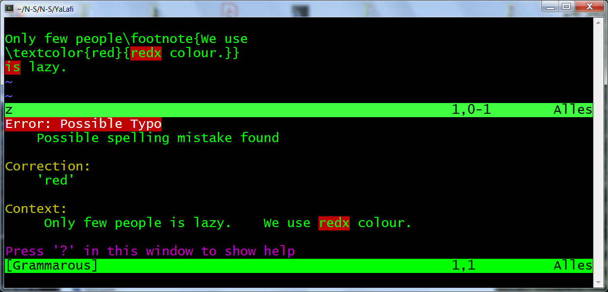
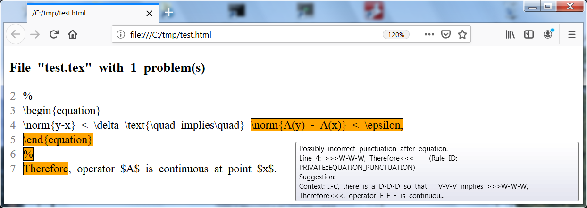

# YaLafi: Yet another LaTeX filter

[Installation](#installation)&nbsp;\|
[Example application](#example-application)&nbsp;\|
[Interface to Vim](#interface-to-vim)&nbsp;\|
[Interface to Emacs](#interface-to-emacs)&nbsp;\|
[Filter actions](#filter-actions)&nbsp;\|
[Principal limitations](#principal-limitations)&nbsp;\|
[Usage under Windows](#usage-under-windows)&nbsp;\|
[Inclusion of own macros](#inclusion-of-own-macros)&nbsp;\|
[Package interface](#package-interface)&nbsp;\|
[Handling of displayed equations](#handling-of-displayed-equations)&nbsp;\|
[Differences to Tex2txt](#differences-to-tex2txt)&nbsp;\|
[Remarks on implementation](#remarks-on-implementation)

This Python package extracts plain text from LaTeX documents.
The software may be integrated with a proofreading tool and an editor.
It provides

- mapping of character positions between LaTeX and plain text,
- simple inclusion of own LaTeX macros and environments with tailored
  treatment,
- careful conservation of text flows,
- detection of trailing interpunction in equations,
- proper handling of nestable LaTeX elements like {} braces.

For instance, the LaTeX input
```
Only few people\footnote{We use
\textcolor{red}{redx colour.}}
is lazy.
```
will lead to the subsequent output from example application script
[yalafi/shell/shell.py](yalafi/shell/shell.py) described in section
[Example application](#example-application) ahead.
The script invokes [LanguageTool](https://www.languagetool.org)
as proofreading software, using a local installation or the Web server
hosted by LanguageTool.
```
1.) Line 2, column 17, Rule ID: MORFOLOGIK_RULE_EN_GB
Message: Possible spelling mistake found
Suggestion: red; Rex; reds; redo; Red; Rede; redox; red x
Only few people is lazy.    We use redx colour. 
                                   ^^^^
2.) Line 3, column 1, Rule ID: PEOPLE_VBZ[1]
Message: If 'people' is plural here, don't use the third-person singular verb.
Suggestion: am; are; aren
Only few people is lazy.    We use redx colour. 
                ^^
```
<a name="example-html-report"></a>
The script can also emulate a LanguageTool server with integrated LaTeX filter
(compare section [Interface to Emacs](#interface-to-emacs)),
and it produces an HTML report when run with option '--output html':


In some sense, this project relates to software like
[OpenDetex](https://github.com/pkubowicz/opendetex),
[pandoc](https://github.com/jgm/pandoc),
[plasTeX](https://github.com/tiarno/plastex),
[pylatexenc](https://github.com/phfaist/pylatexenc),
[TeXtidote](https://github.com/sylvainhalle/textidote), and
[tex2txt](http://hackage.haskell.org/package/tex2txt).

The tool builds on results from [Tex2txt](https://github.com/matze-dd/Tex2txt),
but differs in the internal processing method.
Instead of using recursive regular expressions, a simple tokeniser
and a small machinery for macro expansion are implemented; see sections
[Differences to Tex2txt](#differences-to-tex2txt) and
[Remarks on implementation](#remarks-on-implementation).

Beside the interface from section [Package interface](#package-interface),
application Python scripts like [yalafi/shell/shell.py](yalafi/shell/shell.py)
from section [Example application](#example-application)
can access an interface emulating tex2txt.py from repository Tex2txt by
`from yalafi import tex2txt`.
Direct usage as script is almost the same as for Tex2txt/tex2txt.py, compare
[Tex2txt/README.md](https://github.com/matze-dd/Tex2txt#command-line).
Please note the difference for option --defs described in section
[Differences to Tex2txt](#differences-to-tex2txt).
Invocation as filter: `python -m yalafi [options] [files]`

If you use this tool and encounter a bug or have other suggestions
for improvement, please leave a note under category [Issues](../../issues),
or initiate a pull request.
Many thanks in advance.

Happy TeXing!

[Back to top](#yalafi-yet-another-latex-filter)


## Installation

Choose one of the following possibilities.

- Use `python -m pip install [--user] yalafi`.
  This installs the last version uploaded to [PyPI](https://www.pypi.org).
  Module pip itself can be installed with `python -m ensurepip`.
- Place yalafi/ or a link to it in the current directory.
- Place yalafi/ in a standard directory like `/usr/lib/python3.?/`
  or `~/.local/lib/python3.?/site-packages/`.
- Place yalafi/ somewhere else and set environment variable PYTHONPATH
  accordingly.

[Back to top](#yalafi-yet-another-latex-filter)


## Example application

**Remark.**
You can find examples for tool integration with Bash scripts in
[Tex2txt/README.md](https://github.com/matze-dd/Tex2txt#tool-integration).

Example Python script [yalafi/shell/shell.py](yalafi/shell/shell.py)
has been copied with minor changes from repository
[Tex2txt](https://github.com/matze-dd/Tex2txt)
and subdivided into several files.
It will generate a proofreading report in text or HTML format from filtering
the LaTeX input and application of
[LanguageTool](https://www.languagetool.org) (LT).
It is best called as module as shown below, but can also be placed elsewhere
and invoked as script.
On option '--server lt', LT's Web server is contacted.
Otherwise, [Java](https://java.com) has to be present, and
the path to LT has to be specified with --lt-directory.
Note that from version 4.8, LT does not fully support 32-bit systems any more.
Both LT and the script will print some progress messages to stderr.
They can be suppressed with `python ... 2>/dev/null`.
```
python -m yalafi.shell
                [--lt-directory dir] [--as-server port]
                [--output mode] [--link] [--context number]
                [--include] [--skip regex] [--plain-input]
                [--list-unknown] [--language lang] [--encoding ienc]
                [--replace file] [--define file] [--python-defs module]
                [--extract macros] [--disable rules] [--lt-options opts]
                [--single-letters accept] [--equation-punctuation mode]
                [--server mode] [--lt-server-options opts]
                [--textgears apikey] [--no-config]
                latex_file [latex_file ...] [> text_or_html_file]
```
Option names may be abbreviated.
If option --no-config is not given and if present, options are also read
from a configuration file designated by script variable config\_file
(one option per line, possibly with argument).
Default option values are set at the Python script beginning.
- option `--lt-directory dir`:<br>
  directory of the local LT installation; for instance, it has to contain
  'languagetool-server.jar';
  the LT zip archive, for example LanguageTool-4.9.zip, can be obtained
  from the [LT download page](https://www.languagetool.org/download);
  see also the comment at script variable 'ltdirectory' (the default value)
- option `--as-server port`:<br>
  emulate an LT server listening on the given port,
  see section [Interface to Emacs](#interface-to-emacs) for an example;
  fields of HTML requests (settings for language, rules, categories)
  overwrite values given in command line;
  the internally used proofreader is influenced by options like --server
- option `--output mode`:<br>
  mode is one of plain, html, xml, json; default: plain;
  html: generate HTML report, see below for further details;
  xml: for Vim plug-in, compare section [Interface to Vim](#interface-to-vim)
- option `--link`:<br>
  if HTML report : left-click on a highlighted text part opens Web link
  provided by LT
- option `--context number`:<br>
  number of context lines displayed around each marked text region
  in HTML report; default: 2; negative number: display whole text
- option `--include`:<br>
  track file inclusions like \\input\{...\}; script variable
  'inclusion\_macros' contains list of the corresponding LaTeX macro names
- option `--skip regex`:<br>
  skip files matching the given regular expression;
  useful, e.g., for exclusion of figures on option --include
- option `--plain-input`:<br>
  assume plain-text input: no evaluation of LaTeX syntax;
  cannot be used together with option --include or --replace
- option `--list-unknown`:<br>
  only print list of unknown macros and environments seen outside of
  maths parts
- option `--language lang`:<br>
  language code as expected by LT, default: 'en-GB';
  first two letters are passed to yalafi.tex2txt(), which uses 'en' in case
  of unknown language
- option `--encoding ienc`:<br>
  encoding for LaTeX input and files from options --define and --replace;
  default is UTF-8
- option `--replace file`:<br>
  file with phrase replacements to be performed after conversion to plain
  text; per line, a '\&' sign separated by space splits two parts: first part
  is replaced by second part; space in first part is interpreted as arbitrary
  space not breaking the paragraph; a '#' sign marks rest of line as comment
- option `--define file`:<br>
  read macro definitions as LaTeX code (using \\newcommand)
- option `--python-defs module`:<br>
  modify default definitions in file yalafi/parameters.py by function
  'modify\_parameters()' in the given module;
  compare example in [definitions.py](definitions.py)
- option `--extract macros`:<br>
  only check arguments of the LaTeX macros whose names are given as
  comma-separated list; useful for check of foreign-language text,
  if marked accordingly
- option `--disable rules`:<br>
  comma-separated list of ignored LT rules, passed as --disable to LT;
  default: 'WHITESPACE\_RULE'
- option `--lt-options opts`:<br>
  pass additional options to LT as single string in argument 'opts';
  first character of 'opts' will be skipped and must not be '-';
  for instance: `--lt-options '~--languagemodel ../LT/Ngrams --mothertongue de-DE'`;
  some options are included into HTML requests to an LT server, see script
  variable lt\_option\_map
- option `--single-letters accept`:<br>
  check for single letters, accepting those in the patterns given as list
  separated by '\|';
  for instance `--singe-letters 'A|a|I|e.g.|i.e.||'` for an English text,
  where the trailing '\|\|' causes addition of equation replacements
  from script variable equation\_replacements;
  all characters except '\|' are taken verbatim, but '~' and '\\,' are
  interpreted as UTF-8 non-breaking space and narrow non-breaking space
- option `--equation-punctuation mode`:<br>
  experimental hack for check of punctuation after equations in English texts,
  compare section
  [Equation replacements in English documents](#equation-replacements-in-english-documents)
  and example in section [Differences to Tex2txt](#differences-to-tex2txt);
  abbreviatable mode values, indicating checked equation type:
  'displayed', 'inline', 'all';<br>
  generates a message, if an element of an equation is not terminated
  by a dot '.' and at the same time is not followed by a lower-case word or
  another equation element, both possibly separated by a mark from ',;:';
  patterns for equations are given by script variables
  equation\_replacements\_display and equation\_replacements\_inline
  corresponding to member variables Parameters.math\_repl\_display and
  Parameters.math\_repl\_inline in file yalafi/parameters.py
- option `--server mode`:<br>
  use LT's Web server (mode is 'lt') or a local LT server (mode is 'my');
  stop the local server (mode is 'stop', currently only works under Linux
  and Cygwin)
  - LT's server: address set in script variable 'ltserver';
    for conditions and restrictions, please refer to
    [http://wiki.languagetool.org/public-http-api](http://wiki.languagetool.org/public-http-api)
  - local server: if not yet running, then start it according to script
    variable 'ltserver\_local\_cmd';
    additional server options can be passed with --lt-server-options;
    see also
    [http://wiki.languagetool.org/http-server](http://wiki.languagetool.org/http-server);
    may be faster than command-line tool used otherwise, especially for large
    number of LaTeX files;
    server will not be stopped at the end (use '--server stop')
- option `--lt-server-options opts`:<br>
  pass additional options when starting a local LT server;
  syntax as for --lt-options
- option `--textgears apikey`:<br>
  use the TextGears server, see [https://textgears.com](https://textgears.com);
  language is fixed to American English;
  access key 'apikey' can be obtained on page
  [https://textgears.com/signup.php?givemethatgoddamnkey=please](https://textgears.com/signup.php?givemethatgoddamnkey=please),
  but key 'DEMO\_KEY' seems to work for short input;
  server address is given by script variable textgears\_server
- option `--no-config`:<br>
  do not read config file (its name: script variable 'config\_file')

**Dictionary adaptation.**
LT evaluates the two files 'spelling.txt' and 'prohibit.txt' in directory
```
.../LanguageTool-?.?/org/languagetool/resource/<lang-code>/hunspell/
```
Additional words and words that shall raise an error can be appended here.
LT version 4.8 introduced additional files 'spelling\_custom.txt' and
'prohibit\_custom.txt'.

**HTML report.**
The idea of an HTML report goes back to Sylvain Hallé, who developed
[TeXtidote](https://github.com/sylvainhalle/textidote).
Opened in a Web browser, the report displays excerpts from the original 
LaTeX text, highlighting the problems indicated by LT.
The corresponding LT messages can be viewed when hovering the mouse
over these marked places, see the
[introductory example](#example-html-report) above.
With option --link, Web links provided by LT can be directly opened with
left-click.
Script option --context controls the number of lines displayed
around each tagged region;
a negative option value will show the complete LaTeX input text.
If the localisation of a problem is unsure, highlighting will use yellow
instead of orange colour.
For simplicity, marked text regions that intertwine with other ones
are separately repeated at the end.
In case of multiple input files, the HTML report starts with an index.

[Back to top](#yalafi-yet-another-latex-filter)


## Interface to Vim

For the Vim plug-in
[\[vim-grammarous\]](https://github.com/rhysd/vim-grammarous),
it is possible to provide an interface for checking LaTeX texts.
With an entry in \~/.vimrc, one may simply replace the command that
invokes LanguageTool.
For instance, you can add to your \~/.vimrc
```
let g:grammarous#languagetool_cmd = '/home/foo/bin/yalafi-grammarous'
map <F9> :GrammarousCheck --lang=en-GB<CR>
```
A proposal for Bash script /home/foo/bin/yalafi-grammarous is given in
[yalafi-grammarous](yalafi-grammarous).
It has to be made executable with `chmod +x ...`.
Please adapt script variable `ltdir`, compare option --lt-directory
in section [Example application](#example-application).
If you do not want to have started a local LT server, comment out the line
defining script variable `use_server`.

**Installation of vim-grammarous.**
Download and unzip vim-grammarous.
Create a directory \~/.vim/pack/bundle/start/.
Place vim-grammarous/ under this directory.

Here is the [introductory example](#example-html-report) from above:



[Back to top](#yalafi-yet-another-latex-filter)


## Interface to Emacs

The Emacs plug-in
[\[Emacs-langtool\]](https://github.com/mhayashi1120/Emacs-langtool)
may be used in two variants.
First, you can add to your \~/.emacs
```
(setq langtool-bin "/home/foo/bin/yalafi-emacs")
(setq langtool-default-language "en-GB")
(setq langtool-disabled-rules "WHITESPACE_RULE")
(require 'langtool)
```
A proposal for Bash script /home/foo/bin/yalafi-emacs is given in
[yalafi-emacs](yalafi-emacs).
It has to be made executable with `chmod +x ...`.
Please adapt script variable `ltdir`, compare option --lt-directory
in section [Example application](#example-application).
If you do not want to have started a local LT server, comment out the line
defining script variable `use_server`.

**Server interface.**
This variant may result in better tracking of character positions.
In order to use it, you can write in \~/.emacs
```
(setq langtool-http-server-host "localhost"
      langtool-http-server-port 8082)
(setq langtool-default-language "en-GB")
(setq langtool-disabled-rules "WHITESPACE_RULE")
(require 'langtool)
```
and start yalafi.shell as server in another terminal with
```
$ python -m yalafi.shell --as-server 8082 [--lt-directory /path/to/LT]
```
The server will print some progress messages and can be stopped with CTRL-C.
Further script arguments from section
[Example application](#example-application)
may be given.
If you add, for instance, '--server my', then a local LT server will be used.
It is started on the first HTML request received from Emacs-langtool,
if it is not yet running.

**Installation of Emacs-langtool.**
Download and unzip Emacs-langtool.
Place file langtool.el in directory \~/.emacs.d/lisp/.
Set in your \~/.bash\_profile
```
export EMACSLOADPATH=~/.emacs.d/lisp:
```

Here is the [introductory example](#example-html-report) from above:


[Back to top](#yalafi-yet-another-latex-filter)


## Filter actions

Here is a list of the most important filter operations.
When the filter encounters a LaTeX problem like a missing end of equation,
a message is printed to stderr.
Additionally, the message is included into the filter output together
with the mark from 'Parameters.mark\_latex\_error' in yalafi/parameters.py.
This mark should raise a spelling error from the proofreader at the place
where the problem was detected.

- macro definitions with \\(re)newcommand in input text are processed,
  further flexible treatment of own macros with arbitrary arguments;
  statement \\LTmacros{file.tex} reads macro definitions from given file;
  see also section [Inclusion of own macros](#inclusion-of-own-macros)
- “undeclared” macros are silently ignored, keeping their arguments
  with enclosing \{\} braces removed
- frames \\begin\{...\} and \\end\{...\} of environments are deleted;
  tailored behaviour for environment types listed in
  'Parameters.environment\_defs' in file yalafi/parameters.py;
  see section [Inclusion of own macros](#inclusion-of-own-macros)
- text in heading macros as \\section\{...\} is extracted with
  added interpunction (suppresses false positives from LanguageTool)
- suitable placeholders for \\ref, \\eqref, \\pageref, and \\cite
- arguments of macros like \\footnote are appended to the main text,
  separated by blank lines
- inline maths material $...$ and \\(...\\) is replaced with text from
  rotating collection in 'Parameters.math\_repl\_inline' in
  file yalafi/parameters.py,
  appending trailing interpunction from 'Parameters.math\_punctuation'
- equation environments are resolved in a way suitable for check of
  interpunction and spacing, argument of \\text\{...\} is included into output
  text; \\\[...\\\] and $$...$$ are same as environment displaymath;
  see sections
  [Handling of displayed equations](#handling-of-displayed-equations)
  and
  [Parser for maths material](#parser-for-maths-material)
- generation of numbered default \\item labels for environment enumerate
- some treatment for \\item with specified \[...\] label;
  if the text before ends with a punctuation mark from collection
  'Parameters.item\_punctuation' in file yalafi/parameters.py, then this mark
  is appended to the label;
  works well for German texts, turned off with 'item\_punctuation = []'
- letters with text-mode accents as '\\\`' or '\\v' are translated to 
  corresponding UTF-8 characters
- replacement of things like double quotes '\`\`' and dashes '\-\-' with
  corresponding UTF-8 characters;
  replacement of '\~' and '\\,' by UTF-8 non-breaking space and
  narrow non-breaking space
- for language 'de': suitable replacements for macros like '"\`' and '"=',
  see method 'Parameters.init\_language()' in file yalafi/parameters.py
- treatment of \\verb macro and verbatim environment;
  verbatim can be replaced or removed like other environments with
  appropriate entry in 'Parameters.environment\_defs' in yalafi/parameters.py
- rare warnings from proofreading program can be suppressed using \\LTadd{},
  \\LTskip{}, \\LTalter{}{} in the LaTeX text with suitable macro definition
  there; e.g., adding something that only the proofreader should see:
  \\newcommand{\\LTadd}\[1\]{}

[Back to top](#yalafi-yet-another-latex-filter)


## Principal limitations

The implemented parsing mechanism can only roughly approximate the behaviour
of a real LaTeX system.
We assume that only “reasonable” macros are used, lower-level TeX operations
are not supported.
If necessary, they should be placed in a LaTeX file “hidden” for the filter
(compare option --skip of yalafi.shell in section
[Example application](#example-application)).
A list of remaining incompatibilities must contain at least the following
points.

- Mathematical material is represented by simple replacements.
  As the main goal is application of a proofreading software, we have
  deliberately taken this approach.
- Parsing does not cross file boundaries.
  Tracking of file inclusions is possible though.
- Macros depending on (spacing) lengths may be treated incorrectly.

[Back to top](#yalafi-yet-another-latex-filter)


## Usage under Windows

Both yalafi.shell and yalafi can be used directly in a Windows command
script or console.
For example, this could look like
```
py -3 -m yalafi.shell --output html t.tex > t.html
```
or
```
"c:\Program Files\Python\Python37\python.exe" -m yalafi.shell --output html t.tex > t.html
```
if the Python launcher has not been installed.

Possible encoding issues related to Windows are addressed in
[Tex2txt/README.md](https://github.com/matze-dd/Tex2txt#encoding-problems).

[Back to top](#yalafi-yet-another-latex-filter)


## Inclusion of own macros

Unknown macros and environment frames are silently ignored.
As all input files are processed independently, it may be necessary to
provide project-specific definitions in advance.

For macros, which may be declared with \\newcommand, you can apply
`\LTmacros{file.tex}` as a simple solution.
This adds the macros defined in the given file, skipping all other content.
For the “real” LaTeX, the macro \\LTmacros has to be defined as
`\newcommand{\LTmacros}[1]{}` that is in turn ignored by the filter.

If LaTeX files have to stay untouched, you can use options
--defs and --define for yalafi and yalafi.shell, respectively.
Alternatively, one can add the definitions to member
'Parameters.macro\_defs\_latex' in file yalafi/parameters.py.
Here is a short excerpt from this file:
```
        self.macro_defs_latex = r"""
        ...
        \newcommand{\color}[1]{}
        \newcommand{\colorbox}[2]{#2}
        \newcommand{\documentclass}[2][]{}
        \newcommand{\eqref}[1]{(0)}
        \newcommand{\fcolorbox}[3]{#3}
```

More complicated macros as well as environments have to be registered
with Python code.
This may be done with options --pyth and --python-defs for yalafi and
yalafi.shell, respectively;
see the example in [definitions.py](definitions.py).
Alternatively, you can modify the collections
'Parameters.macro\_defs\_python' and 'Parameters.environment\_defs'
in yalafi/parameters.py.

### Definition of macros

`Macro(parms, name, args='', repl='', defaults=[], extract='')`

- `parms`: current object of type Parameters
- `name`: macro name with '\\'
- `args`: string that codes the argument sequence
    - 'A': mandatory argument, may be a single token or a sequence
      enclosed in {} braces
    - 'O': optional argument in \[\] brackets
    - '\*' optional asterisk
- `repl`: replacement string as for \\newcommand ('\*' does count as argument),
  or a function (see file [yalafi/handlers.py](yalafi/handlers.py)
  for examples)
- `defaults`: an optional list of replacement strings for absent optional
  arguments
- `extract`: like `repl`, but the resulting text is appended to the main
  text, separated by blank lines; for an example, see declaration of macro
  \\footnote in 'Parameters.macro\_defs\_python' in yalafi/parameters.py

### Definition of environments

`Environ(parms, name, args='', repl='', defaults=[], remove=False, add_pars=True, items=None)`

Argument `parms` to `defaults` are the same as for `Macro()`, where the
arguments are those behind the opening '\\begin{xyz}'.
This means that the environment name 'xyz' does not yet count as argument
in `args` and `repl`.

- `remove`: if True, then the complete environment body is skipped;
  a fixed replacement can be given in `repl`
- `add_pars`: if True, then paragraph breaks (blank lines) are generated
  before and behind the environment body
- `items`: for inclusion of specific \\item labels;
  a generator taking a nesting level argument has to be specified;
  compare declaration of environment enumerate in yalafi/paramters.py

### Definition of equation environments

`EquEnv(parms, name, args='', repl='', defaults=[], remove=False)`

This is equivalent to `Environ()`, but maths material is replaced according to
section
[Handling of displayed equations](#handling-of-displayed-equations).
Replacements in `repl` and `defaults` are still interpreted in text mode.

- `remove`: if True, then a fixed replacement can be specified in `repl`,
and trailing interpunction given by 'Parameters.math\_punctuation' in
file yalafi/parameters.py is appended

[Back to top](#yalafi-yet-another-latex-filter)


## Package interface

We comment the central function in file
[yalafi/tex2txt.py](yalafi/tex2txt.py)
that uses the package interface to emulate the behaviour of
script tex2txt.py in repository
[Tex2txt](https://github.com/matze-dd/Tex2txt).

```
 1  from . import parameters, parser, utils
 2  def tex2txt(latex, opts):
 3      def read(file):
 4          try:
 5              with open(file, encoding=opts.ienc) as f:
 6                  return True, f.read()
 7          except:
 8              return False, ''
 9      parms = parameters.Parameters(opts.lang)
10      if opts.defs:
11          parms.add_latex_macros(opts.defs)
12      if opts.pyth:
13          exec('import ' + opts.pyth)
14          exec(opts.pyth + '.modify_parameters(parms)')
15      if opts.extr:
16          extr = ['\\' + s for s in opts.extr.split(',')]
17      else:
18          extr = []
19      p = parser.Parser(parms, read_macros=read)
20      toks = p.parse(latex, extract=extr)
21      txt, pos = utils.get_txt_pos(toks)
22      if opts.repl:
23          txt, pos = utils.replace_phrases(txt, pos, opts.repl)
24      if opts.unkn:
25          txt = '\n'.join(p.get_unknowns()) + '\n'
26          pos = [0 for n in range(len(txt))]
27      pos = [n + 1 for n in pos]
28      return txt, pos
```
- 3-8: This is an auxiliary function for the parser.
- 9: The created parameter object contains all default settings
  and definitions from file yalafi/parameters.py.
- 11: If requested by script option --defs, additional macros are included
  from the string opts.defs.
- 14: On option --pyth, we call a function to modify the parameter object,
  see file [definitions.py](definitions.py) for an example.
- 15-18: If option --extr requests only extraction of arguments of certain
  macros, this is prepared.
- 19: We create a parser object, the passed function is called on \\LTmacros.
- 20: The parsing method returns a list of tokens.
- 21: The token list is converted into a 2-tuple containing the plain-text
  string and a list of numbers.
  Each number in the list indicates the estimated position of the
  corresponding character in the text string.
- 23: If phrase replacements are requested by option --repl, this is done.
  String opts.repl contains the replacement specifications read from the file.
- 25: On option --unkn, a list of unknown macros and environments is
  generated.
- 27: This is necessary, since position numbers are zero-based in yalafi,
  but one-based in Tex2txt/tex2txt.py.

[Back to top](#yalafi-yet-another-latex-filter)


## Handling of displayed equations

Displayed equations should be part of the text flow and include the
necessary interpunction.
The German version of
[LanguageTool](https://www.languagetool.org) (LT)
will detect a missing dot in the following snippet.
For English texts, see the comments in section
[Equation replacements in English documents](#equation-replacements-in-english-documents)
ahead.
```
Wir folgern
\begin{align}
    a   &= b \\
    c   &= d
\end{align}
Daher ...
```
Here, 'a' to 'd' stand for arbitrary mathematical
terms (meaning: “We conclude \<maths\> Therefore, ...”).
In fact, LT complains about the capital “Daher” that should start a
new sentence.

### Trivial version

With the entry
```
    Environ(self, 'align', remove=True, add_pars=False),
```
in 'Parameters.environment\_defs' of file yalafi/parameters.py,
the equation environment is simply removed.
We get the following filter output that will probably cause a problem,
even if the equation itself ends with a correct interpunction sign.
```
Wir folgern
Daher ...
```

### Simple version

With the entry
```
    EquEnv(self, 'align', repl='  Relation', remove=True),
```
in 'Parameters.environment\_defs', one gets:
```
Wir folgern
  Relation
Daher ...
```
Adding a dot '= d.' in the equation will lead to 'Relation.' in the output.
This will also hold true, if the interpunction sign
('Parameters.math\_punctuation') is followed by maths space or by macros
as \\label and \\nonumber.

### Full version

With the default entry
```
    EquEnv(self, 'align'),
```
we obtain (“gleich” means equal, and setting language to English will
produce “equal”):
```
Wir folgern
  V-V-V  gleich W-W-W
  W-W-W  gleich X-X-X.
Daher ...
```
The replacements like 'V-V-V' are taken from collection
'Parameters.math\_repl\_display' that depends on language setting, too.
Now, LT will additionally complain about repetition of 'W-W-W'.
Finally, writing '= b,' and '= d.' in the equation leads to the output:
```
Wir folgern
  V-V-V  gleich W-W-W,
  X-X-X  gleich Y-Y-Y.
Daher ...
```
The rules for equation parsing are described in section
[Parser for maths material](#parser-for-maths-material).
They ensure that variations like
```
    a   &= b \\
        &= c.
```
and
```
    a   &= b \\
        &\qquad -c.
```
also will work properly.
In contrast, the text
```
    a   &= b \\
    -c  &= d.
```
will again produce an LT warning due to the missing comma after 'b',
since the filter replaces both 'b' and '-c' by 'W-W-W' without
intermediate text.

In rare cases, manipulation with \\LTadd{} or \\LTskip{} may be necessary
to avoid false warnings from the proofreader.

### Inclusion of “normal” text

In variant “Full version”, the argument of \\text\{...\}
(macro names: collection 'Parameters.math\_text\_macros') is directly copied.
Outside of \\text, only maths space like \\; and \\quad
(see 'Parameters.math\_space') is considered as space.
Therefore, one will get warnings from the proofreading program, if subsequent
\\text and maths parts are not properly separated.

### Equation replacements in English documents

The replacement collection of 'Parameters.math\_repl\_display' in file
yalafi/parameters.py does not work well, if single letters are taken as
replacements.
For instance, 'V.' cannot be safely considered as end of a sentence.
We now have chosen replacements as 'U-U-U' for German and English texts.

Furthermore, the English version of LanguageTool (like other proofreading
tools) rarely detects mistakenly capital words inside of a sentence;
they are probably considered as proper names.
Therefore, a missing dot at the end of a displayed equation is hardly found.
An experimental hack is provided by option --equation-punctuation of
application script [yalafi/shell/shell.py](yalafi/shell/shell.py)
described in section
[Example application](#example-application).

[Back to top](#yalafi-yet-another-latex-filter)


## Differences to Tex2txt

Invocation of `python -m yalafi ...` differs as follows from
`python tex2txt.py ...` (the script described in
[Tex2txt/README.md](https://github.com/matze-dd/Tex2txt#command-line)).

- Option --defs expects a file containing macro definitions as LaTeX code.
- Option --ienc is also effective for file from --defs.
- Option --char (position tracking for single characters) is always activated.
- Default language is English. It is also used for an unknown language.
- Macro definitions with \\(re)newcommand in the LaTeX input are processed.
- Macro arguments need not be delimited by {} braces or \[\] brackets.
- Macros are expanded in the order they appear in the text.
- Character position tracking for displayed equations is improved,
  see the example below.
- Parameters like predefined LaTeX macros and environments are set in file
  [yalafi/parameters.py](yalafi/parameters.py).
  You can modify them at run-time with script option '--pyth module'.
  The given Python module has to provide a function
  'modify\_parameters(parms)' receiving the parameter object 'parms',
  compare the example in [definitions.py](definitions.py).

YaLafi/yalafi/tex2txt.py is faster for input texts till about 30 Kilobytes,
for larger files it can be slower than 'Tex2txt/tex2txt.py --char'.
Run-time increases quasi linearly with file size.
Due to token generation for each single “normal” character, memory usage
may be substantial for long input texts.

Number of effective code lines (without blank and pure comment lines)
is around 1050 for Tex2txt/tex2txt.py and 1350 for yalafi/\*.py in total.

With
```
python -m yalafi.shell --equation-punct all --output html test.tex > test.html
```
and input 
```
For each $\epsilon > 0$, there is a $\delta > 0$ so that
%
\begin{equation}
\norm{y-x} < \delta \text{\quad implies\quad}
    \norm{A(y) - A(x)} < \epsilon, \label{lab}
\end{equation}
%
Therefore, operator $A$ is continuous at point $x$.
```
we get




[Back to top](#yalafi-yet-another-latex-filter)


## Remarks on implementation

### Scanner / tokeniser

The scanner identifies token types defined in yalafi/defs.py.

- All “normal” characters yield an own token.
- Many character combinations like '{', '\\\[' or '---' are recognised
  as “special tokens”.
- Names of “normal” macros formed by a backslash and subsequent letters
  (method 'Parameters.macro\_character()') result in a token, macros
  '\\begin', '\\end', '\\item', and '\\verb' are treated separately.
- For space, we distinguish between character sequences that do or do not
  represent a paragraph break.
  In both cases, a single token is generated.
- Comments starting with '%' consume the rest of the line and leading space
  on the next line, if it is not blank.
  A single token is generated.

### Parser

The central method 'Parser.expand\_sequence()' does not directly read from
the scanner, but from an intermediate buffer that can take back tokens.
On macro expansion, the parser simply pushes back all tokens generated by
argument substitution.
The result is close to the “real” TeX behaviour, compare the tests in
directory tests/.

A method important for simple implementation is 'Parser.arg\_buffer()'.
It creates a new buffer that subsequently returns tokens forming a macro
argument (only a single token or all tokens enclosed in paired {} braces
or \[\] brackets).

### Parser for maths material

We follow the ideas described in section
[Handling of displayed equations](#handling-of-displayed-equations),
compare the tests in [tests/test\_display.py](tests/test_display.py).
All unknown macros, which are not in the blacklist 'Parameters.math\_ignore',
are assumed to generate some “visible” output.
Thus, it is not necessary to declare all the maths macros like \\alpha
and \\sum.

Displayed equations are parsed as follows.

- Equation environments are split into “lines” separated by '\\\\'.
- Each “line” is split into “sections” delimited by '\&'.
- Each “section” is split into “maths parts” only consisting of maths
  material separated by intermediate \\text{...} or \\mbox{...}
  ('Parameters.math\_text\_macros').
- Arguments of \\text and \\mbox are directly copied.
- A “maths part” is substituted with a placeholder from rotating collection
  'Parameters.math\_repl\_display', if it does not consist only of punctuation
  marks from 'Parameters.math\_punctuation' or of operators from
  'Parameters.math\_operators'.
- A leading maths operator is displayed using 'Parameters.math\_op\_text'
  (language-dependent), if the “maths part” is first in “section” and
  the “section” is not first on “line”.
- Trailing interpunction of a “maths part” is appended to the placeholder.
- If the “maths part” includes leading or trailing maths space from
  'Parameters.math\_space', then white space is prepended or appended to the
  replacement.
- Replacements from 'Parameters.math\_repl\_display' are rotated
    - if a non-blank \\text part is detected,
    - if a “maths part” starts with an operator and is first in “section”,
      but not on “line”
    - if a “maths part” only consists of an operator,
    - if a “maths part” includes trailing interpunction.

[Back to top](#yalafi-yet-another-latex-filter)

### Removal of unnecessary blank lines

In order to avoid creation of new blank lines by macros expanding to space or
“nothing”, we include a token of type 'ActionToken' whenever
expanding a macro.
Method 'Parser.remove\_pure\_action\_lines()' removes all lines only
containing space and at least one such token.
Initially empty lines are retained.

[Back to top](#yalafi-yet-another-latex-filter)

